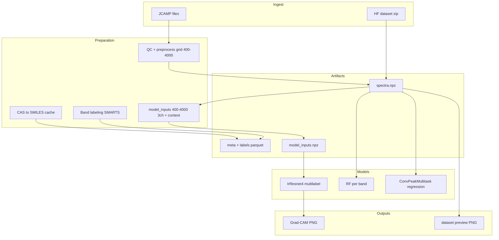

# Архитектура IR Pipeline

## Поток данных



## Две колеи глубокого обучения

| Колея | Модуль | Задача |
|-------|--------|--------|
| A | `torch_train.ConvPeakMultitask` | Регрессия ν пика по полосам |
| B | `models.IrResnet4` | Multi-label: полоса присутствует |

## Вход IrResnet4

Тензор `(batch, 3, L)`, `L=1801` (400–4000 см⁻¹, шаг 2) + опционально `context` (one-hot техники/фазы):

1. **wavenumbers** — фиксированная сетка
2. **absorption** — поглощение после интерполяции с сетки датасета
3. **peaks** — маска пиков (peakutils)

Сборка: [`resnet_input.py`](../src/ir_pipeline/resnet_input.py) → кэш `model_inputs.npz` (при обучении или Grad-CAM).

## Метки multi-label

Для каждого `band_id` из [`bands_reference.yaml`](../configs/bands_reference.yaml): метка `1` при `spectrum`/`structure` — если есть `observed_peak_cm1`; при `structure_smarts` — если строка есть в `labels_structure_smarts.parquet` (SMARTS-only, пик не обязателен).

## Превью датасета

[`dataset_preview.py`](../src/ir_pipeline/dataset_preview.py): спектр + вертикальные метки spectrum (оранж.) и structure (син.).

## Grad-CAM (ручной режим)

```bash
ir-pipeline gradcam-examples --run-dir runs/<irresnet_run> \
  --spectrum-indices 0,5,12 --class-indices 3,12
```

Без индексов — первые N спектров и классы по порогу sigmoid. Модуль: [`gradcam.py`](../src/ir_pipeline/gradcam.py).

## Оркестратор

[`stage_runner.py`](../src/ir_pipeline/stage_runner.py) + [`configs/stages.yaml`](../configs/stages.yaml):

- `run stage <name>` — одна стадия
- `run profile smoke|full_local` — цепочка
- состояние в `pipeline_state.json`

## Модули

| Файл | Роль |
|------|------|
| `dataset_build.py` | Сборка датасета |
| `dataset_preview.py` | Превью и баланс классов |
| `resnet_input.py` | 3-канальный вход IrResnet4 |
| `train_sklearn.py` | RF + measurement_mode features |
| `irresnet_train.py` | Обучение IrResnet4 |
| `gradcam.py` | Grad-CAM визуализация |
| `logging_utils.py` | log + heartbeat |
| `metrics_plot.py` | MAE plots для RF |
