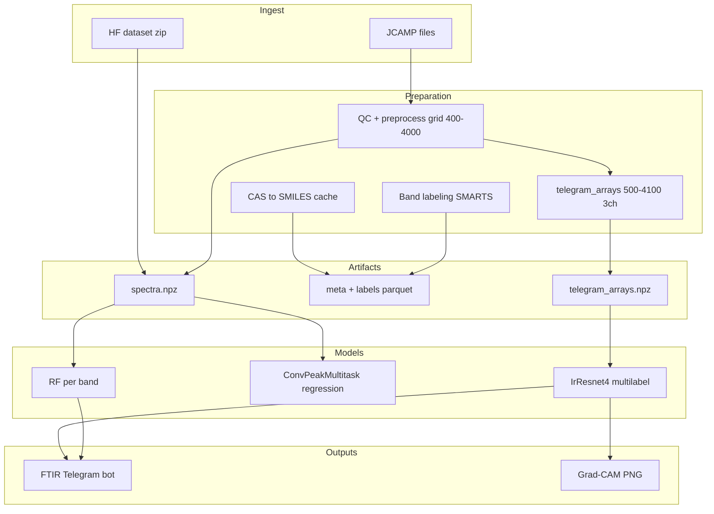

# Архитектура IR Pipeline

## Поток данных



## Две колеи глубокого обучения

| Колея | Модуль | Задача | Интеграция с ботом |
|-------|--------|--------|-------------------|
| A | `torch_train.ConvPeakMultitask` | Регрессия ν пика по полосам | Нет (эксперимент) |
| B | `models.IrResnet4` | Multi-label: полоса присутствует | Да: `prepare_input` 3×1801 |

## Вход IrResnet4 (как в Telegram-боте)

Тензор `(batch, 3, L)`, `L=1801` (500–4100 см⁻¹, шаг 2):

1. **wavenumbers** — фиксированная сетка
2. **absorption** — после `convert_to_absorption` + интерполяция
3. **peaks** — маска пиков (peakutils)

Сборка: [`telegram_preprocess.py`](../src/ir_pipeline/telegram_preprocess.py), сохранение в `telegram_arrays.npz` при `build-dataset`.

## Метки multi-label

Для каждого `band_id` из [`bands_reference.yaml`](../configs/bands_reference.yaml): метка `1`, если в `labels_spectrum.parquet` есть `observed_peak_cm1` для этой полосы.

## Оркестратор

[`stage_runner.py`](../src/ir_pipeline/stage_runner.py) + [`configs/stages.yaml`](../configs/stages.yaml):

- `run stage <name>` — одна стадия
- `run profile smoke|full_local` — цепочка
- состояние в `pipeline_state.json` (пути к `rf_run`, `irresnet_run`)

## Экспорт в бот

```
runs/.../irresnet_run/irresnet_bundle.pt
    → export-telegram
    → FTIR_telegram_bot/models/v0.1.0.34/
         v0.1.0.34_model_param
         v0.1.0.34_classes.txt
         v0.1.0.34.pt
```

Загрузка в боте: [`ftir_models.load_single_model`](../../FTIR_telegram_bot/ftir_models.py).

## Модули

| Файл | Роль |
|------|------|
| `dataset_build.py` | Сборка датасета + telegram npz |
| `train_sklearn.py` | RF + measurement_mode features |
| `irresnet_train.py` | Обучение IrResnet4 |
| `gradcam.py` | Explainability |
| `export_telegram.py` | Пакет для бота |
| `logging_utils.py` | log + heartbeat |
| `metrics_plot.py` | MAE plots для RF |
